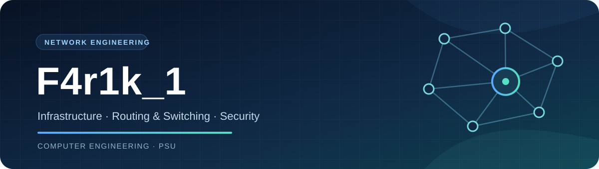

  

  <h1>Hi, I'm F4r1k_1 👋</h1>
  
<strong>4th-year Computer Engineering student at Prince of Songkla University (PSU)</strong>

  
Focused on network engineering, infrastructure operations, and network security.

  

    <a href="https://github.com/patt502090/CE-Group1-NetOps">Enterprise Network &amp; SOC</a>
    &nbsp;·&nbsp;
    <a href="https://github.com/farikz?tab=repositories">All repositories</a>
  

---

## 🌐 Network engineering

I have hands-on experience with Cisco Layer 2/3 switches through a System Engineer internship, including deployment, configuration, connectivity testing, troubleshooting, and infrastructure support. My work and coursework cover:

| Area | Skills and tools |
| --- | --- |
| **Routing & switching** | VLANs, trunking, inter-VLAN routing, static routing, OSPF, port management |
| **Network security** | NAT, VPN, firewall policies, 802.1X, FreeRADIUS, Samba Active Directory |
| **Monitoring & operations** | Wazuh, Grafana, Syslog, SNMP, connectivity verification |
| **Wireless** | Access point planning and simulation for coverage and performance |

## 🛠️ Featured network project

### [Enterprise Network & Security Infrastructure](https://github.com/patt502090/CE-Group1-NetOps)

A **team project** built around physical Cisco equipment and an enterprise network/SOC stack. It brings together VLAN segmentation, Layer 3 routing, firewall policies, 802.1X authentication with FreeRADIUS and Samba AD, and centralized monitoring with Wazuh and Grafana. The repository includes topology, configuration, and operational documentation.

## 💻 Other projects

| Project | What it explores |
| --- | --- |
| [Thaiwork · SmartDoc Assistant](https://github.com/farikz/thaiwork-6610110223) | Hybrid RAG question answering over a Thai overseas-worker document, with source citations |
| [Homepro LINE Chatbot](https://github.com/farikz/homepro-line-chatbot-6610110223) | Product search through a LINE chatbot using Python, Flask, and semantic intent detection |

## 📚 Additional background

- **Programming:** Python; embedded project work with Flask, MQTT, NodeMCU, and Arduino.
- **Certificates:** Cyber Threat Management, Network Cabling for Engineering, and Alibaba Cloud Certified Associate.

Thanks for visiting. The linked repositories show the systems, code, and documentation behind these projects.
